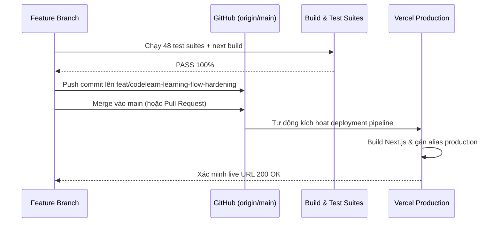

# Tài Liệu Triển Khai & Vận Hành (Deployment & Release Guide)

**Dự án**: Tin Học Gen Z  
**Ngày cập nhật**: 15/09/2026  

---

## 1. Thông tin Định danh Hạ tầng & Kho mã nguồn

- **GitHub Repository**: `HUYJSC/tinhocjgenz` ([https://github.com/HUYJSC/tinhocjgenz.git](https://github.com/HUYJSC/tinhocjgenz.git))
- **Production Branch**: `main`
- **Active Feature Branch**: `feat/codelearn-learning-flow-hardening`
- **Vercel Scope / Account**: `dinhhuy05707` (`hdhhutech-6413`)
- **Vercel Project**: `tinhocgenz` (ID: `prj_NnSR3lS6rguIJIgmFtt8RMSwCOrd`)
- **Node.js Runtime**: `24.x` (Next.js 16.2.6 với Turbopack)
- **Tên miền hoạt động**:
  - `https://www.tinhocgenz.io.vn/`: Tên miền chính thức công khai (Canonical Production)
  - `https://tinhocgenz.io.vn/`: Tên miền Apex
  - `https://hoctructuyen.tinhocgenz.io.vn/`: Cổng hệ thống đào tạo LMS
  - `https://pay.tinhocgenz.io.vn/`: Cổng thanh toán & hóa đơn

---

## 2. Cấu hình Bảo vệ Triển khai (Deployment Protection)

### Vấn đề đã xử lý:
Trước đó, Vercel bật chế độ `ssoProtection` (`all_except_custom_domains`), dẫn đến việc khách truy cập `https://www.tinhocgenz.io.vn/` bị chuyển hướng đến `https://vercel.com/sso-api` ("Log in to Vercel").

### Cấu hình chuẩn xác:
- **Public Site**: Đã tắt SSO toàn trang bằng lệnh:
  ```bash
  vercel project protection disable tinhocgenz --sso
  ```
- **Bảo mật ứng dụng**: Không phụ thuộc vào Vercel SSO ở tầng ngoài mà thực thi tại tầng ứng dụng (`proxy.ts` và `AdminAuthGate`):
  - `/admin/*`: Chặn truy cập không có JWT session hợp lệ hoặc không có quyền `admin` / `super_admin`.
  - `/portal/*`: Chuyển hướng 307 an toàn về cổng đăng nhập LMS.
  - `/api/admin/*`: Trả mã HTTP 403 Forbidden nếu không có quyền quản trị.
  - Public routes (`/`, `/khoa-hoc`, `/khoa-hoc/[id]`, `/blog`, `/thi-thu`): Trả mã HTTP 200 OK cho mọi khách truy cập.

---

## 3. Quy trình Phát hành (Release Workflow)



### Các bước phát hành:
1. **Kiểm tra cục bộ**:
   ```bash
   node scripts/verify-sprint0-1.mjs
   node scripts/verify-sprint2.mjs
   node scripts/verify-sprint3.mjs
   node scripts/verify-sprint4.mjs
   npm run build
   ```
2. **Commit & Push**:
   ```bash
   git add .
   git commit -m "feat(learning): implement CodeLearn-inspired interactive learning flow and catalog search"
   git push origin feat/codelearn-learning-flow-hardening
   ```
3. **Merge vào `main`**:
   Tiến hành merge feature branch vào `main` để Vercel tự động triển khai phiên bản mới nhất.

---

## 4. Kế hoạch Hoàn tác (Rollback Procedure)

Nếu xảy ra sự cố nghiêm trọng sau khi triển khai phiên bản mới:
1. **Rollback tức thì trên Vercel** (không cần rebuild mã nguồn):
   - Mở Vercel Dashboard -> Project `tinhocgenz` -> Tab Deployments.
   - Tìm deployment ổn định trước đó (ví dụ: `https://tinhocgenz-3aciwb7xa-dinhhuy05707.vercel.app`).
   - Nhấp biểu tượng 3 chấm `...` -> Chọn **Promote to Production** (Hoặc dùng lệnh `vercel alias <deployment-url> www.tinhocgenz.io.vn`).
   - Quá trình chuyển đổi chỉ mất từ 1 đến 3 giây.
2. **Rollback mã nguồn trên Git**:
   ```bash
   git checkout main
   git revert HEAD -m 1
   git push origin main
   ```
3. **Lưu ý về Dữ liệu**:
   - Tính năng học tập mới chỉ bổ sung bảng/khoá dữ liệu lưu tiến độ mới, không sửa đổi hay xóa bỏ bất kỳ cấu trúc dữ liệu học viên hay lịch học cũ.
   - Không có nguy cơ mất mát dữ liệu kế thừa khi rollback.
