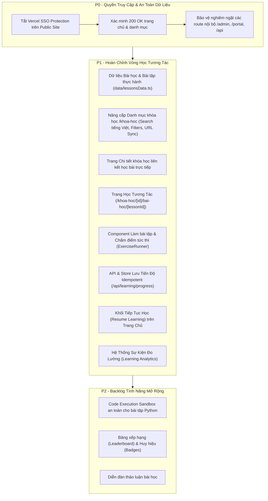

# Kế Hoạch Triển Khai (Implementation Plan) - Tin Học Gen Z

**Tham chiếu**: Nguyên tắc tổ chức học tập [CodeLearn.io](https://codelearn.io/) (Học tập -> Xem chi tiết -> Học bài -> Làm bài tập -> Nhận phản hồi -> Lưu tiến độ -> Tiếp tục học).  
**Thương hiệu & Nội dung**: Tin Học Gen Z (MOS, IC3, Tin học thực chiến, Văn phòng, Python).  

---

## 1. Phân loại mức độ ưu tiên (P0 / P1 / P2)

---

## 2. Chi tiết thực hiện P0 (Đã hoàn thành & Kiểm chứng)

### 2.1. Quyền truy cập công khai
- **Hành động**: Chạy lệnh `vercel project protection disable tinhocgenz --sso`.
- **Kết quả**: Khách không cần tài khoản Vercel vẫn có thể truy cập `https://www.tinhocgenz.io.vn/` (HTTP 200 OK).
- **An toàn**:
  - Không nhúng token/secret vào frontend.
  - Các route quản trị (`/admin`) và cổng nội bộ (`/portal/student`, `/portal/teacher`, `/portal/academic`, `/api/admin/*`) tiếp tục được bảo vệ bởi server-side proxy middleware (`proxy.ts`) và mã hóa PBKDF2/JWT session.

---

## 3. Chi tiết thực hiện P1 (Hoàn chỉnh Vòng học tập tương tác)

### 3.1. Cấu trúc dữ liệu bài học & bài tập (`data/lessonsData.ts`)
- Xây dựng mô hình dữ liệu:
  - `Chapter`: Chương học (ví dụ: Kỹ năng định dạng, Xử lý dữ liệu, Hàm tìm kiếm,...).
  - `Lesson`: Bài học với nội dung hướng dẫn chi tiết, hình ảnh minh họa, phím tắt, mẹo thi Certiport.
  - `Exercise`: Câu hỏi thực hành / trắc nghiệm gắn liền với từng bài học, có bộ test validation, giải thích đáp án chi tiết.

### 3.2. Nâng cấp Danh mục khóa học (`app/khoa-hoc/page.tsx`)
- Thanh tìm kiếm tức thì với thuật toán loại bỏ dấu tiếng Việt (Accent-insensitive normalization).
- Bộ lọc theo danh mục (`MOS & IC3`, `Thực chiến văn phòng`, `Tất cả`).
- Đồng bộ hai chiều với URL qua `useSearchParams` (`?q=...&category=...`).
- Hiển thị số lượng kết quả tìm thấy, có giao diện Empty State với nút "Xóa bộ lọc".

### 3.3. Nâng cấp Trang chi tiết khóa học (`app/khoa-hoc/[id]/page.tsx`)
- Lộ trình bài học (Syllabus) chuyển đổi từ danh sách tĩnh sang các thẻ bài học có thể click vào để học ngay.
- Nút CTA chính: "Bắt đầu học ngay" / "Học thử bài đầu tiên" dẫn thẳng vào bài học 1.

### 3.4. Trang học tương tác (`app/khoa-hoc/[id]/bai-hoc/[lessonId]/page.tsx`)
- Thiết kế theo tiêu chuẩn CodeLearn:
  - **Cột trái (Desktop) / Drawer (Mobile)**: Mục lục toàn bộ các chương và bài học của khóa, hiển thị trạng thái hoàn thành (Checkmark xanh) và bài đang học.
  - **Khu vực trung tâm**: Nội dung lý thuyết và hướng dẫn thực hành (Typography rõ ràng, line-height 1.6, khoảng đọc 65-80 ký tự/dòng).
  - **Khu vực bài tập thực hành (Exercise Section)**: Bài tập tương tác gắn liền với bài học, gồm câu hỏi, các lựa chọn/thao tác, nút "Kiểm tra kết quả", thông báo đúng/sai và giải thích chi tiết.
  - **Thanh điều hướng chân trang (Sticky Footer Bar)**: Nút "Bài trước", "Bài tiếp theo", nút "Hoàn thành bài học".

### 3.5. Lưu trữ tiến độ học tập Idempotent (`/api/learning/progress` & `lib/learning-store.ts`)
- Lưu trạng thái hoàn thành theo bộ khóa: `{ courseId, lessonId }`.
- Thiết kế API idempotent: Gửi nhiều lần không bị cộng dồn hay nhân đôi điểm số/tiến độ.
- Cơ chế lưu trữ đa tầng:
  - Tài khoản đăng nhập: Lưu vào hệ thống lưu trữ server.
  - Khách vãng lai (Guest): Lưu vào LocalStorage của trình duyệt và thông báo rõ ràng "Tiến độ đang lưu trên thiết bị này".

### 3.6. Trang chủ: Khối "Tiếp tục học" (`components/ContinueLearningWidget.tsx`)
- Tự động nhận diện bài học gần nhất người dùng đã truy cập.
- Hiển thị banner gọn gàng ngay đầu trang hoặc trong hero: Tên bài học, khóa học, % hoàn thành và nút "Tiếp tục học ngay".

### 3.7. Đo lường học tập chuẩn mực (`lib/analytics.ts` & `docs/analytics.md`)
- Theo dõi các mốc hành vi chính:
  - `course_view`: Học viên xem trang khóa học.
  - `lesson_start`: Bắt đầu mở một bài học.
  - `lesson_complete`: Hoàn thành bài học.
  - `exercise_submit`: Gửi câu trả lời bài tập.
  - `exercise_result`: Nhận kết quả bài tập (đúng/sai).
  - `resume_learning`: Nhấp nút tiếp tục học từ trang chủ.

---

## 4. Kế hoạch P2 (Backlog trung hạn)
- **C1 - Python Code Execution Sandbox**: Xây dựng container sandbox (WebAssembly/Pyodide hoặc Docker worker tách biệt) có timeout 5s, giới hạn 128MB RAM, chặn network/filesystem hoàn toàn trước khi cho phép chạy mã Python của học viên.
- **C2 - Gamification**: Bảng xếp hạng tuần/tháng, huy hiệu đạt điểm tối đa (1000 điểm MOS), chuỗi ngày học liên tục (Streak).
- **C3 - Thảo luận bài học**: Bình luận và giải đáp thắc mắc dưới mỗi bài học.

---

## 5. Tiêu chí nghiệm thu (Acceptance Criteria)

1. **Khách vãng lai**: Mở trang chủ và danh mục khóa học không bị hỏi đăng nhập Vercel (HTTP 200).
2. **Tìm kiếm & Lọc**: Gõ "excel", "word", "mos", "tin hoc" ra đúng kết quả; gõ tiếng Việt có dấu hoặc không dấu đều tìm thấy; xóa filter trả về ban đầu.
3. **Luồng học trọn vẹn**:
   - Khám phá khóa học -> Xem chi tiết -> Bấm "Bắt đầu học" -> Vào bài học 1.
   - Đọc nội dung -> Làm bài tập -> Chọn đáp án đúng/sai -> Nhận giải thích.
   - Bấm "Hoàn thành & Sang bài tiếp" -> Tiến độ cập nhật thành công.
   - F5 tải lại trang -> Tiến độ hoàn thành vẫn được giữ nguyên.
   - Quay lại trang chủ -> Xuất hiện khối "Tiếp tục học" trỏ đúng bài học vừa làm.
4. **An toàn bảo mật**: Route `/admin`, `/portal/*`, `/api/admin/*` không bị ảnh hưởng, giữ nguyên mã phản hồi 307/403.
5. **Độ ổn định**: Chạy toàn bộ test suites hiện có và test mới đạt 100% PASS, build Next.js thành công không có lỗi TypeScript hay Linting.

